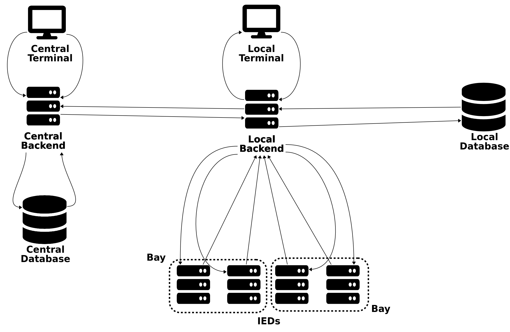

 

## Objectives of the Free SCADA system
- Be device-agnostic.
- Be easy to mantain.
- Be scalable as needed.
- Be user friendly.
- Be automated.
- Be relaiable.

## Modules:
Here's a list of the main modules of the system:
- Backend
- Terminal
- Database

### Backend
This module has the responsability of allow the access to a local database, 
acquire the data from the devices and send command to the devices coming from 
the terminals.

### Terminal
The terminal has the responsability of drawing the UI according to the database's 
models and send commands to the backend.

### Database
The database has to store the data to draw the UI and the implementations of the 
backend's models. It can only be accessed from the backend.

